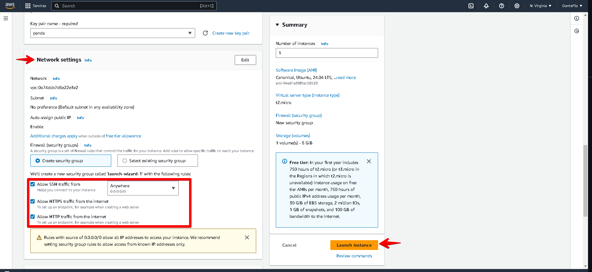
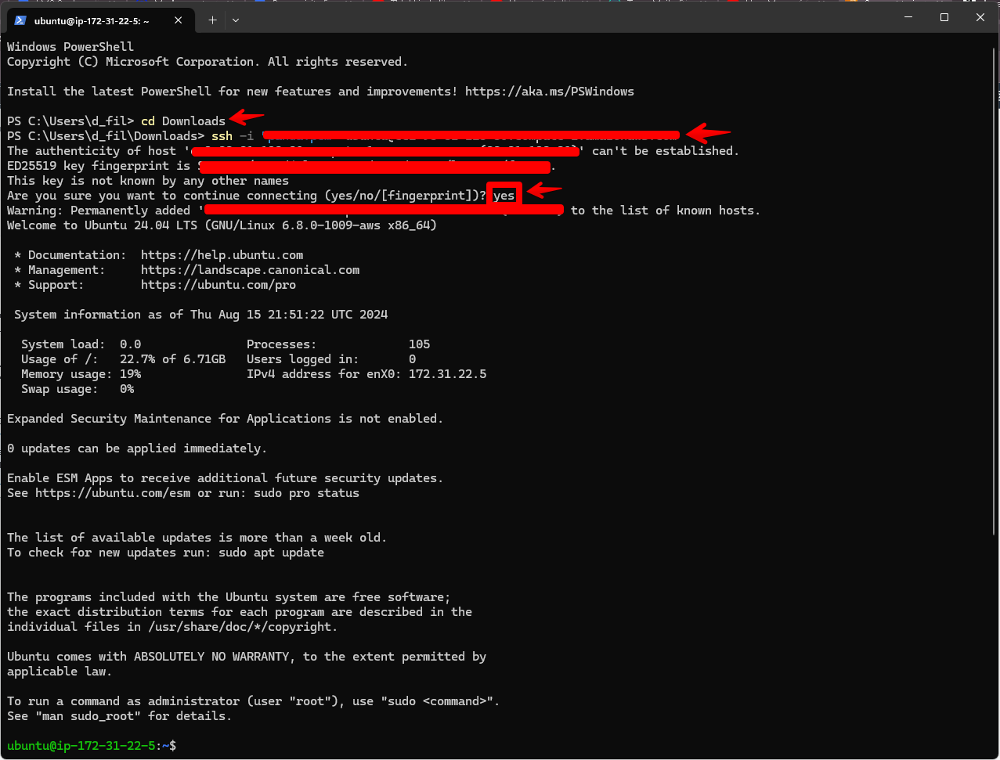
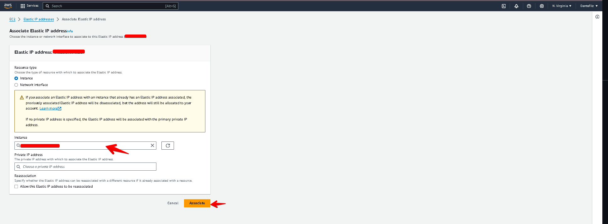
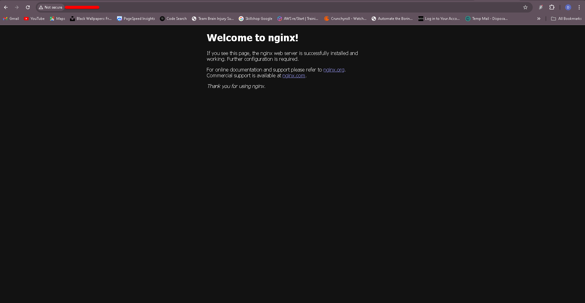
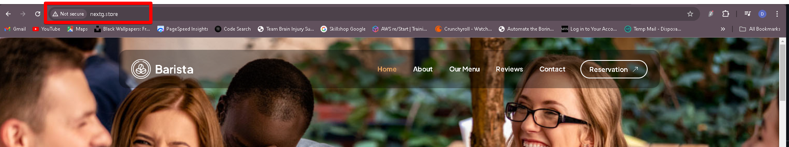
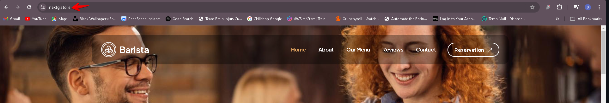

# Project 1 Title: Static Website setup Using Nginx

## Introduction

In this project, we’ll build a simple, secure website using NGINX, Amazon Route 53, and Certbot. NGINX will handle showing our website to visitors, making sure it loads quickly. Amazon Route 53 will take care of our website’s address (like www.example.com) so that people can easily find it online. To keep the site secure, we’ll use Certbot to set up HTTPS, which means any data sent to or from the site is encrypted and safe. By the end, we’ll have a website that’s easy to access and secure for all visitors

## Checklist

- [x] Task 1: Buy a domain name from a domain Registrar.
- [x] Task 2: Spin up a Ubuntu server & assign an elastic IP to it.
- [x] Task 3: SSH into the server and install Nginx.
- [x] Task 4: Find freely available HTML website files.
- [x] Task 5: Download and unzip the website files to the Nginx website directory.
- [x] Task 6: Validate the website using the server IP address.
- [x] Task 7: In Route53, create an A record and add the Elastic IP.
- [x] Task 8: Using DNS verify the website setup.
- [x] Task 9: Install certbot and Request For an SSL/TLS Certificate.
- [x] Task 10: Validate the website SSL using the OpenSSL utility.

## Documentation

### Setting up an Ubuntu Server
- Login into your AWS Account as a **Root User** 
- Search and click on **EC2** within the AWS management console
- Click on **Launch instance** button
- Give a title to the instance using the **Name** field and then select the **Ubuntu** AMI from the **Quick Start** options
- Scroll down to **Key pair (login)** and click on **Create new key pair** button to generate a key pair for secure connection to your instance.
- Input a **Key pair name** and click on **Create key pair**
- On the **Network settings**, select the boxes for each of the follow;  **SSH**, **HTTP**, and **HTTPS** access, then click **Launch instance**

> [!NOTE]
For security reasons, it's recommended to restrict SSH access to your IP address only. However, for the purpose of this documentation, access has been granted from anywhere.

- Click on **View all instances**
- Click on the **created instance**
- Click on the **Connect** button
- Copy the command provided under **`SSH client`** header

---------

**How to open a terminal in your downloads folder on windows**

- Navigate to your downloads folder (or the folder where you saved your .pem file), **Open in terminal**
- Use the `cd` command to navigate to the folder where your `.pem` file is located.
- input **cd ~/Downloads** and paste **SSH client** copied
- Press `Enter` to execute the command.

### Create And Assign an Elastic IP

- Log into your AWS console account and click on the **menu icon** to open the dashboard menu
- Click **Elastic IPs** under **Network & Security**
- Click on the **Allocate Elastic IP address** button
- Proceed to click on **Allocate**
- **Associate this Elastic IP address** with your running instance
- Select the instance you wish to associate with the elastic IP address, then click on **Associate**.

> [!NOTE]
The IP address for your instance has been updated to the elastic IP associated with it. Therefore, you will need to SSH into your instance again. Return to the connection page of your instance and copy the new command.

- Paste the **command** into your terminal and then press Enter. When prompted, type **"yes"** and press Enter to connect.

----------

### How to Install Nginx and Setup Your Website

- Execute the following commands.

`sudo apt update`

`sudo apt upgrade`

`sudo apt install nginx`

- Start your Nginx server by running the **`sudo systemctl start nginx`** command, enable it to start on boot by executing **`sudo systemctl enable nginx`**, and then confirm if it's running with the **`sudo systemctl status nginx`** command
- Go back to your EC2 dashboard and copy your **Public IPv4 address**
- Visit your instances **Public IPv4 address** in a web browser to view the default Nginx startup page

---------
- Download your website template from your preferred website by navigating to the website, locating the template you want, and obtaining the download URL for the website.

**How to obtain the website template URL from tooplate.com:**

- Visit [**Tooplate**](https://www.tooplate.com/) and select the website template you prefer
- Scroll down to the download section, right-click to open the menu, and select **Inspect** from the options
- Select the **Network** tab
- Click the **Download** button
- You’ll see the **website zip folder** appear. Hover your mouse or trackpad pointer over it and right-click again

> [!NOTE]
Make sure you right-click on the zip folder, the one that says **.zip**. If it doesn't appear after clicking download, try clicking the download button again until it shows up, as shown in the picture.

- Select **Copy** and then click on **Copy URL** from the list that appears on the right
- Paste the URL into a notebook/sticker note to use alongside the **`curl`** command when downloading the website content to your machine
- On your terminal, Run the command **`sudo curl -o /var/www/html/2137_barista_cafe.zip https://www.tooplate.com/zip-templates/2137_barista_cafe.zip`** to download the websites file to your html directory

----------------

- To install the unzip tool, run the following command in your ubuntu terminal: **`sudo apt install unzip`**
- Run this command to locate the web server directory: **`cd /var/www/html`**
- Unzip the contents of your website by running **`sudo unzip <website template name>`**

> [!NOTE]
Replace **`<website template name>`** with the actual name of your website zip file. For example, mine is **2137_barista_cafe.zip** so i ran **`sudo unzip 2137_barista_cafe.zip`**.

- Update your nginx configuration by running the command **`sudo nano /etc/nginx/sites-available/default`**. Then, edit the **`root`** directive within your server block to point to the directory where your downloaded website content is stored
- Restart Nginx to apply the changes by running: **`sudo systemctl restart nginx`**.
- Open a web browser and go to your **Public IPv4 address/Elastic IP address** to confirm that your website is working as expected.

---

### Create An A Record

You must configure a DNS record if you want people to reach your website using your domain name instead of its IP address. A domain was purchased on Namecheap, transferred my hosting to AWS Route 53, and created an A record there

- On the website select **Domain List**
- Click on the **Manage** button
- Log into your AWS console, search  and select **Route 53** from the list of services displayed
- Click on **Get started**
- Select **Create hosted zones** and click on **Get started**
- Input your **Domain name**, choose **Public hosted zone** and then click on **Create hosted zone**
- Select the **created hosted zone①** and copy the assigned **Values**
- Return to your domain registrar and select **Custom DNS** within the **NAMESERVERS** section
- Paste the values copied from Route 53 into the appropriate fields, then select the **checkmark symbol** to save the changes done
- Head back to your AWS console and click on **Create record**
- Paste your Elastic IP address and then click on **Create records**
- Your A record has been successfully created
- Click on **create record** again, to create the record for your sub domain
- Input the Record name(**www**), paste your **IP address**, and then click on **Create records**.

> [!NOTE]
Make sure to create DNS records for both your root domain and subdomain. This involves setting up an A record for the root domain (e.g., **`example.com`**) and another A record for the subdomain (e.g., **`www.example.com`**). These records will direct traffic to your server's IP address, ensuring that both your main site and any subdomains are accessible

- Open your terminal and run **`sudo nano /etc/nginx/sites-available/default`** to edit your settings. Enter your domain and subdomain names, then save the changes
- Restart your nginx server by running the **`sudo systemctl restart nginx`** command
- Go to your domain name in a web browser to verify that your website is accessible

> [!NOTE]
The **Not secure** sign may be shown to you. After that, you'll utilize certbot to get the SSL certificate required to make your website HTTPS-capable

---

### Install certbot and Request For an SSL/TLS Certificate

- Install certbot by executing the following commands:
**`sudo apt update`**
**`sudo apt install certbot python3-certbot-nginx`**
- Execute the **`sudo certbot --nginx`** command to request your certificate. Follow the instructions provided by certbot and select the domain name for which you would like to activate HTTPS
- Confirm the website's SSL using the OpenSSL utility with the command: **`openssl s_client -connect jaykaneki.cloud:443`**
- Go to your **`https://<domain name>`** in this case **https://nextg.store** to view your website

---
---

#### The End Of Project 1