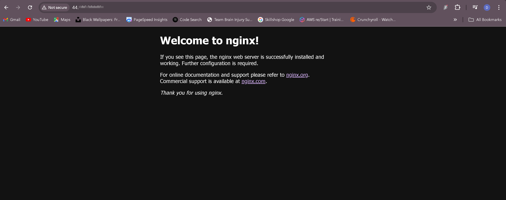
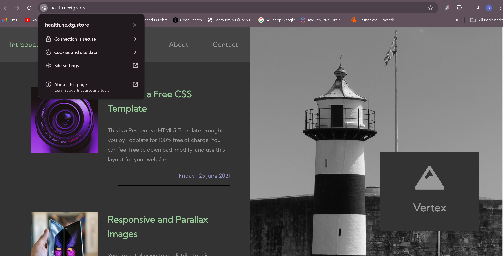

# Project 2 Title: Setup Multiple Static Websites on a Single Server Using Nginx Virtual Hosts

## Introduction

In this project, we are going to learn about subdomains and how to set up Nginx Virtual Host to host several websites on a single server.

## Checklist

- [x] Task 1: Spin up a Ubuntu server & assign an elastic IP to it.
- [x] Task 2: SSH into the server and install and configure Nignx on a server.
- [x] Task 3: Create two website directories with two different website templates.
- [x] Task 4: Create two subdomains
- [x] Task 5: Add the IP of the server as A record to the two subdomains.
- [x] Task 6: Configure the Virtual host to point two subdomains to two different website directories.
- [x] Task 7: Validate the setup by accessing the subdomains.
- [x] Task 8: Create a certbot SSL certificate for the root Domain.
- [x] Task 9: Configure certbot on Nginx for the two websites.
- [x] Task 10: Validate the subdomain websites’ SSL using OpenSSL utility.

## Documentation

### Setting up an Ubuntu Server
- Login into your AWS Account as a **Root User** 
- Search and click on **EC2** within the AWS management console
- Click on **Launch instance** button
- Give a title to the instance using the **Name** field and then select the **Ubuntu** AMI from the **Quick Start** options
- Scroll down to **Key pair (login)** and click on **Create new key pair** button to generate a key pair for secure connection to your instance.
- Input a **Key pair name** and click on **Create key pair**
- On the **Network settings**, select the boxes for each of the follow;  **SSH**, **HTTP**, and **HTTPS** access, then click **Launch instance**

## Install Nginx and Setup Your Website
# Execute the following commands.
- **`sudo apt update`**  
- **`sudo apt upgrade`**
- **`sudo apt install nginx`**

### Use the **`sudo systemctl start nginx`** command to launch your Nginx server. Then, use the **`sudo systemctl enable nginx`** command to make sure it runs upon boot. Finally, use the **`sudo systemctl status nginx`** command to verify that it is up and running.

* To see the default Nginx launch page, open a web browser and navigate to your instance's IP address.
* Go to the website of your choice, find the template you want, and download your website template..
* Choose Inspect from the drop-down menu by performing a right-click.
* After selecting the Network tab, click the Download option.
* Right click on the website name, select Copy and click on Copy link address.
* To install the unzip tool, run the following command: **`sudo apt install unzip`**
* Execute the command to download and unzip your website files **`sudo curl -o /var/www/html/2098_health.zip https://www.tooplate.com/zip-templates/2098_health.zip && sudo unzip -d /var/www/html/ /var/www/html/2098_health.zip && sudo rm -f /var/www/html/2098_health.zip`**~
* Donwload the second template for the website and run the above command again.

* To set up your website's configuration, create a new file in the Nginx sites-available directory. 
Use this command to open a blank file in a text editor: **`~sudo nano /etc/nginx/sites-available/cleaning~`**
* Edit the root directive within your server block to point to the directory where your downloaded website content is stored.
* Copy and paste the following code into the open text editor. 

server {
    listen 80;
    server_name example.com www.example.com;

    root /var/www/html/example.com;
    index index.html;

    location / {
        try_files $uri $uri/ =404;
    }
}

* Edit the root directive within your server block to point to the directory where your downloaded website content is stored.
* Follow the same steps for the secind website by creating a new file in the Nginx sites-available directory.
* Then create a symbolic link for both websites by running the following command.

+ **`sudo ln -s /etc/nginx/sites-available/cleaning /etc/nginx/sites-enabled/`** 
+ **`sudo ln -s /etc/nginx/sites-available/health /etc/nginx/sites-enabled/`**

* Run the **`sudo nginx -t`** command to check the syntax of the Nginx configuration file.
* Delete the default files in the sites-available and sites-enabled directories by executing the following commands:

+ **`sudo rm /etc/nginx/sites-available/default`**
+ **`sudo rm /etc/nginx/sites-enabled/default`**

* Restart the Nginx server by executing the following command: **`sudo systemctl restart nginx`**

### Create An A Record

You must configure a DNS record if you want people to reach your website using your domain name instead of its IP address. A domain was purchased on Namecheap, transferred my hosting to AWS Route 53, and created an A record there

- On the website select **Domain List**
- Click on the **Manage** button
- Log into your AWS console, search  and select **Route 53** from the list of services displayed
- Click on **Get started**
- Select **Create hosted zones** and click on **Get started**
- Input your **Domain name**, choose **Public hosted zone** and then click on **Create hosted zone**
- Select the **created hosted zone①** and copy the assigned **Values**
- Return to your domain registrar and select **Custom DNS** within the **NAMESERVERS** section
- Paste the values copied from Route 53 into the appropriate fields, then select the **checkmark symbol** to save the changes done
- Head back to your AWS console and click on **Create record**
- Paste your Elastic IP address and then click on **Create records**
- Your A record has been successfully created
- Click on **create record** again, to create the record for your sub domain
- Input the Record name(**www**), paste your **IP address**, and then click on **Create records**.
- Repeat the same process while creating your second subdomain record, and confirm that they both exist in the records list.
- Open your terminal and run **`sudo nano /etc/nginx/sites-available/cleaning`** to edit your settings. Enter the name of your domain and then save your settings.
- Run **`sudo nano /etc/nginx/sites-available/health`** to edit your settings. Enter the name of your domain and then save your settings.
- Restart your nginx server by running the **`sudo systemctl restart nginx`** command.
- To make sure your website is reachable, open a web browser and navigate to your domain name.

### Install certbot and Request For an SSL/TLS Certificate

- Install certbot by executing the following commands:
**`sudo apt update`**
**`sudo apt install certbot python3-certbot-nginx`**
- Execute the **`sudo certbot --nginx`** command to request your certificate. Follow the instructions provided by certbot and select the domain name for which you would like to activate HTTPS

- Confirm the website's SSL using the OpenSSL utility with the command: **`openssl s_client -connect jaykaneki.cloud:443`**
- Go to your **`https://<domain name>`** in this case **https://health.nextg.store** and **https://cleaning.nextg.store** to view your website

