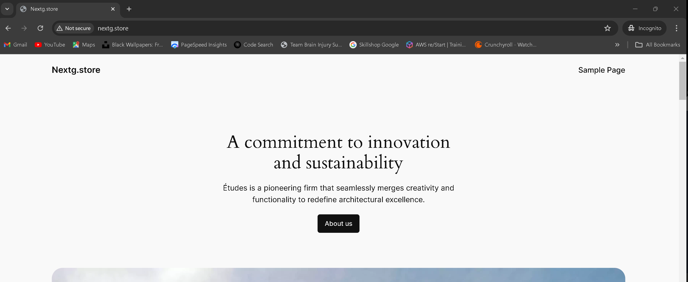

# Project 4: Setup WordPress Website Using LAMP Stack

## Introduction

Building a robust and scalable online presence with a WordPress website using the LAMP stack (Linux, Apache, MySQL, and PHP) is a smart move. This project will guide us through each stage of the installation and configuration of WordPress for optimal speed, as well as the setup of our server environment. The ebd goal is to know how to build and manage a WordPress website using the LAMP stack, giving us a reliable, effective, and customizable platform for our content.

## Checklist

- [x] Task 1: Deploy an Ubuntu Server
- [x] Task 2: Set up your LAMP stack on the server
- [x] Task 3: Configure the wordpress Application
- [x] Task 4: Map the IP address to the DNS A record
- [x] Task 5: Validate the WordPress website setup by accessing the web address.

## Documentation

### Setting up an Ubuntu Server
- Login into your AWS Account as a **Root User** 
- Search and click on **EC2** within the AWS management console
- Click on **Launch instance** button
- Give a title to the instance using the **Name** field and then select the **Ubuntu** AMI from the **Quick Start** options
- Scroll down to **Key pair (login)** and click on **Create new key pair** button to generate a key pair for secure connection to your instance.
- Input a **Key pair name** and click on **Create key pair**
- On the **Network settings**, select the boxes for each of the follow;  **SSH**, **HTTP**, and **HTTPS** access, then click **Launch instance**
- Repeat for your second server and load balancer, making sure to label appropriately
- Then Set an inbound rule for MYSQL in the security group. Click on Security① and select the Security group②.

- Click on Edit inbound rules.
- Click on Add rule.
- Click on Custom TCP① and select MySQL/Aurora②.
- Enter the IP address① you want to allow access and click Save rules②.

- Open your terminal and connect to your Ubuntu server via SSH.

## Install Apache
# Execute the following commands.
- **`sudo apt update`**  
- **`sudo apt install apache2`**

### Use the command line **`sudo systemctl enable apache2`** to enable apache start on boot. Then, use the **`sudo systemctl status apache2`** command to verify its status.

* To check if the server is running and accessibble both via internet and locally, run the command.
- **`curl http://localhost:80`**

* We then proceed to check if our Apache HTTP server responds to requests from the Internet...
* Copy your public IPv4 address from your EC2 dashboard.
* Open a web browser and then go to the URL: http://<Public-IP-Address>:80, using your public IPv4 address.
* If the installation was successful, the page below show display.

## Install MYSQL
# Execute the following commands.
- **`sudo apt install mysql-server`**  
- After the installation is complete, log in to the MySQL console by typing: .**`sudo mysql`**

* Run the following command to set the password for the root user with the MySQL native password authentication method: 
- **` ALTER USER 'root'@'localhost' IDENTIFIED WITH mysql_native_password BY 'pass';`**. 
- Exit the MySQL shell by typing **`exit`**
- Start the interactive script by running: **`sudo mysql_secure_installation①`**. Answer y② for yes, or any other key to continue without enabling specific options.
- Set your password validation policy level to 0 = low level
- Enable MySQL to start on boot by executing 
- **`sudo systemctl enable mysql①`**, and then confirm its status with the **`sudo systemctl status mysql②`**  command.

## Install PHP
# Execute the following commands.
- **`sudo apt install php-curl php-gd php-mbstring php-xml php-xmlrpc php-soap php-intl php-zip`**
- **`sudo apt install php libapache2-mod-php php-mysql`**
- Confirm the downloaded PHP version by running **`php -v`** 
 

## Creating A Virtual Host For Your Website Using Apache
# Execute the following commands to create the directory for Projectlamp using the "mkdir" commands.
- **`sudo mkdir /var/www/projectlamp`**
- Assign ownership of the directory to our current system user using: **`sudo chown -R $USER:$USER /var/www/projectlamp`**
- Create and open a new configuration file in Apache's sites-available directory using the preferred command-line editor: 
- **`sudo vi /etc/apache2/sites-available/projectlamp.conf`**.
- Creating this will produce a new blank file. Paste the configuration text provided below into it:

<VirtualHost *:80>

ServerName projectlamp

ServerAlias www.projectlamp

ServerAdmin webmaster@localhost

DocumentRoot /var/www/projectlamp

ErrorLog ${APACHE_LOG_DIR}/error.log

CustomLog ${APACHE_LOG_DIR}/access.log combined

</VirtualHost>

- Save the changes by pressing the Esc key, then type **`:wq`** and press **`Enter`**.
- Run the ls command **`sudo ls /etc/apache2/sites-available①`** to show the new file② in the sites-available directory.

- Enable the new virtual host using the a2ensite command: **`sudo a2ensite projectlamp`**.
- Disable Apache's default website, use the a2dissite command: **`sudo a2dissite 000-default`** .
- Ensure the configuration file doesn’t contain syntax errors by running the command: **`sudo apache2ctl configtest`**. 
- "Syntax OK" should display in the output if your configuration is correct.

Then run: **`sudo systemctl reload apache2`**. This will reload Apache for the changes to take effect.

[!NOTE]
Our new website is now active, but the web root /var/www/projectlamp is still empty. Let's create an index.html file in that location to test that the virtual host works as expected.

- Create the index.html file with the content "Hello LAMP from <yourname>" in the /var/www/projectlamp directory, use the following command: **`sudo echo 'Hello LAMP from Filz' > /var/www/projectlamp/index.html`**.
- Now, let's open our web browser and try to access our website using the IP address: **`http://<EC2-Public-IP-Address>:80`** replacing the EC2-Public IP with the actual EC2 instance created

- Remove the index.html file by running the following command: **`sudo rm /var/www/projectlamp/index.html`**

## Enable PHP On The Website
# When using Apache's default DirectoryIndex settings, an index.html file will always take priority over an index.php file. You must update the dir.conf file in order to modify the order in which index files (for example, index.php over index.html) are ranked in Apache. Here's how to go about it:

- Edit the dir.conf file using a text editor (such as nano or vi): **`sudo nano /etc/apache2/mods-enabled/dir.conf`**
- Look for the DirectoryIndex directive within this file. It typically looks like this:

<IfModule mod_dir.c>
    DirectoryIndex index.html index.cgi index.pl index.php index.xhtml index.htm
</IfModule>

- To prioritize index.php over index.html, move index.php to the beginning of the list, like this:

<IfModule mod_dir.c>
    DirectoryIndex index.php index.html index.cgi index.pl index.xhtml index.htm
</IfModule>

- Press **`ctrl + x①`** on your keyboard to save and exit.
- Reload Apache for the changes to take effect: **`sudo systemctl reload apache2`**.

# Now, when two files are present in the same directory, Apache will give index.php priority over index.html.
- To create a new file named index.php inside your custom web root folder (/var/www/projectlamp), you can use the following command to open it in the nano text editor: **`nano /var/www/projectlamp/index.php`**.
- This will create a new file. Copy and paste the following PHP code into the new file:

<?php

phpinfo();

- Return to the web browser and reload the page after saving and closed the file. The image below show display

You can use the rm command to do so: **`sudo rm /var/www/projectlamp/index.php`**.

## Install Wordpress
# We may configure our LAMP environment first, and then start the WordPress installation procedure. First, download the WordPress installation files and place them in the default web server root directory, /var/www/html.

- Navigate to the directory using the cd command: **`cd /var/www/html`** 
- Then download the WordPress installation files using the following command: **`sudo wget -c http://wordpress.org/latest.tar.gz`**
- Extract the files from the downloaded WordPress archive using the command: **`sudo tar -xzvf latest.tar.gz`**
- Run the command **`ls -l`** to confirm the existence of the wordpress directory in the current location **`(/var/www/html)`**.

[!NOTE]
The files must be owned by the user of your web server. Identify the web server's user and assign the appropriate permissions accordingly. The user **`www-data`** is widely adopted as the default user for web server processes, especially on Ubuntu and Debian systems. This user oversees the operation of web server software (like Apache or Nginx) and manages incoming web requests. However, for verification and for tasks involving services that may not have a predefined user, checking the user of the web server is advisable.

- Check the user running the web server with the command: **`ps aux | grep apache | grep -v grep`**.

- Grant ownership of the WordPress directory and its files to the web server user (www-data) by running the command: **`sudo chown -R www-data:www-data /var/www/html/wordpress`**.

## Create a Database For Wordpress
- Access your MySQL root account with the following command: **`sudo mysql -u root -p①`**. Enter the password② you set earlier when prompted.
- To create a separate database named wp_db for WordPress to manage, execute the following command in the MySQL prompt: **`CREATE DATABASE wp_db;`**

[!NOTE]
This command allows you to create a new database (wp_db) within your MySQL environment. Feel free to name it as you prefer.

- To access the new database, you can create a MySQL user account with a strong password using the following command: **`CREATE USER filz@localhost IDENTIFIED BY 'wp-password';`**
- To grant your created user (filz@localhost) all privileges needed to work with the wp_db database in MySQL, use the following commands:

GRANT ALL PRIVILEGES ON wp_db.* TO filz@localhost;
FLUSH PRIVILEGES;

[!NOTE]
This grants all privileges (ALL PRIVILEGES) on all tables within the wp_db database (wp_db.*) to the user jay when accessing from localhost. The FLUSH PRIVILEGES command ensures that MySQL implements the changes immediately. Adjust the database name (wp_db) and username (jay) as per your setup.

- Type exit to **`exit`** the MySQL shell.
- Grant executable permissions recursively (-R) to the wordpress folder using the following command: **`sudo chmod -R 777 wordpress/`**

[!NOTE]
This command sets read (r), write (w), and execute (x) permissions for the owner, group, and others on all files and directories within the wordpress folder. Using 777 permissions is quite permissive and may not be necessary for all files and folders; consider adjusting permissions based on security requirements.

- Change into the WordPress directory by running the command: **`cd wordpress`**

## Configure Wordpress
# Setting up and configuring WordPress itself is an essential next step after creating a database for WordPress. You must first generate a configuration file specifically for WordPress.

- Rename the sample WordPress configuration file with the command: **`mv wp-config-sample.php wp-config.php`**.
- Edit the wp-config.php file using the command: **`sudo nano wp-config.php`**.
- Update the database settings in the **`wp-config.php`** file by replacing placeholders like database_name_here, username_here, and password_here with your actual database details.
- Modify the configuration file projectlamp.conf: **`sudo nano /etc/apache2/sites-available/projectlamp.conf`** to update the document root to the directory where your WordPress installation is located.
- After updating the document root to **`/var/www/html`** directory in your editor, save the changes and exit.
- Reload Apache for the changes to take effect: **`sudo systemctl reload apache2`**.
- Once you've completed these steps, you can access your WordPress page to complete the installation. Open your web browser and go to **`http://<EC2 IP>/wordpress/`**. This will lead you to the WordPress setup wizard where you can finalize the installation process.

[!NOTE]
Replace with the IP address of your EC2 instance when accessing your WordPress page.
- Select your preferred language and then click on Continue to proceed.

# Enter the required information and click on Install WordPress once you have finished.
- Site Title①: Enter the name of your WordPress website. It's recommended to use your domain name for better optimization.
- Username②: Choose a username for logging into WordPress.
- Password③: Set a secure password to protect your WordPress account.
- Your email④: Provide your email address to receive updates and notifications.
- Search engine visibility⑤: You can leave this box unchecked to prevent search engines from indexing your site until it's ready.
- Log into the admin dashboard

### Create An A Record

You must configure a DNS record if you want people to reach your website using your domain name instead of its IP address. A domain was purchased on Namecheap, transferred my hosting to AWS Route 53, and created an A record there

## Point your domain's A records to the IP address of your Nginx load balancer server.
- On the website select **Domain List**
- Click on the **Manage** button
- Log into your AWS console, search  and select **Route 53** from the list of services displayed
- Click on **Get started**
- Select **Create hosted zones** and click on **Get started**
- Input your **Domain name**, choose **Public hosted zone** and then click on **Create hosted zone**
- Select the **created hosted zone①** and copy the assigned **Values**
- Return to your domain registrar and select **Custom DNS** within the **NAMESERVERS** section
- Paste the values copied from Route 53 into the appropriate fields, then select the **checkmark symbol** to save the changes done
- Head back to your AWS console and click on **Create record**
- Paste your Elastic IP address and then click on **Create records**
- Your A record has been successfully created
- Click on **create record** again, to create the record for your sub domain
- Input the Record name(**www**), paste your **IP address**, and then click on **Create records**.
- To update your Apache configuration file in the sites-available directory to point to your domain name, use the command: **`sudo nano /etc/apache2/sites-available/projectlamp.conf.`**

[!NOTE]
This command opens the projectlamp.conf file in the nano text editor with superuser privileges (sudo). Within the editor, adjust the necessary details to reflect your domain name configuration.

- Ensure that the server settings in your Apache configuration point to your domain name, and that the document root accurately points to your WordPress directory. Once you've made these adjustments, save the changes and exit the editor.

<VirtualHost *:80>
    ServerName <Your root domain name>
    ServerAlias <Your sub domain name>
    ServerAdmin webmaster@<Your root domain name>

    DocumentRoot /var/www/html/wordpress

    <Directory /var/www/html/wordpress>
        Options Indexes FollowSymLinks
       # AllowOverride All
        Require all granted
    </Directory>

    ErrorLog ${APACHE_LOG_DIR}/error.log
    CustomLog ${APACHE_LOG_DIR}/access.log combined
</VirtualHost>

[!NOTE]
The new configuration defines how Apache should handle requests for your domain, and its subdomain. With this configuration: Apache will handle requests for nextg.store and www.nextg.store. Files will be served from the **`/var/www/html/wordpress`** directory. Directory listings and symbolic links are allowed. The directory can be accessed by any client. Error logs will be written to **`/var/log/apache2/error.log`**. Access logs will be written to **`/var/log/apache2/access.log`** in the combined log format.

- To update your **`wp-config.php`** file with DNS settings, use the following command: **`sudo nano wp-config.php`** and add these lines to the file:

/** MY DNS SETTINGS */
define('WP_HOME', 'http://<domain name>');

define('WP_SITEURL', 'http://<domain name>');

Replace **`http://<domain name>`** with your actual domain name. Save the changes and exit the editor.

- Reload your Apache server to apply the changes with the command: **`sudo systemctl reload apache2`**, After reloading, visit your website at **`http://<domain name>`** to view your WordPress site. Replace with your actual domain name.

- To log in to your WordPress admin portal, visit **`http://<domain name>/wp-admin`**, Enter your username① and password②, then click on log In③. Replace with your actual domain name.
- visit **`http://nextg.store/wp-admin`**.
- Now that your WordPress site is successfully configured to use your domain name, the next step is to secure it by requesting an SSL/TLS certificate.

### Install certbot and Request For an SSL/TLS Certificate

- Install certbot by executing the following commands on our load balancer terminal:
**`sudo apt update`**
**`sudo apt install certbot python3-certbot-apache`**
- Execute the **`sudo certbot --apache`** command to request your certificate. Follow the instructions provided by certbot and select the domain name for which you would like to activate HTTPS

* Access your website to verify that Certbot has successfully enabled HTTPS.

---
---

#### The End Of Project 4