# Project 5: Setup Service Discovery Using Nginx & Consul

## Introduction

Service discovery in DevOps is all about automating the process by which services locate one another on a network. In contemporary microservices architectures, where programs are constructed from numerous tiny, autonomous services, it is particularly crucial.
Services used to be hardcoded with other services' locations (such as IP addresses). As things change and services are dynamically scaled up or down, this becomes a nightmare to manage.

## Checklist

- [x] Task 1: Deploy an Ubuntu Server
- [x] Task 2: Allow required ports in the security group
- [x] Task 3: Set up architecture
- [x] Task 4: Setup Consul Server
- [x] Task 5: Setup Backend Servers
- [x] Task 6: Setup Load-Balancer
- [x] Task 7: Validate Service Discovery Setup


## Documentation

### Setting up an Ubuntu Server
- Login into your AWS Account as a **Root User** 
- Search and click on **EC2** within the AWS management console
- Click on **Launch instance** button
- Give a title to the instance using the **Name** field and then select the **Ubuntu** AMI from the **Quick Start** options
- Scroll down to **Key pair (login)** and click on **Create new key pair** button to generate a key pair for secure connection to your instance.
- Input a **Key pair name** and click on **Create key pair**
- On the **Network settings**, select the boxes for each of the follow;  **SSH**, **HTTP**, and **HTTPS** access, then click **Launch instance**
- Repeat for your second server and load balancer, making sure to label appropriately
- Then Set an inbound rule for MYSQL in the security group. Click on Security① and select the Security group②.
- Rename your EC2 instances to prevent any confusion during your project.
- Click on the edit icon.

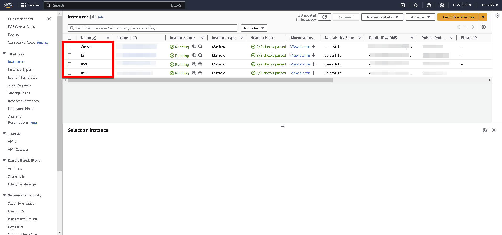

- Renamed the server and click the checkmark icon.
- Renamed the Consul server, LoadBalancer server, and the two backend servers for easy identification.

###To make sure the proper functioning of the Consul service, opened the following ports in your security group apply the same security group of all instances.

Consul Servers
S/N	Port Name	Protocol	Default Port
1	DNS	TCP and UDP	8600
2	HTTP API	TCP	8500
3	HTTPS API	TCP	8501
4	gRPC	TCP	8502
5	gRPC TLS	TCP	8503
6	Server RPC	TCP	8300
7	LAN Serf	TCP and UDP	8301
8	WAN Serf	TCP and UDP	8302

- checked the box next to the instance and clicked on Security②, and then the security group ID③.
- Click on Edit inbound rules.
- Click on Add rule.
- Enter the Port range.
- Choose the appropriate CIDR block.
- Click on Add Rule to specify the port range for the UDP protocol.
- Click on the Type field① and choose Custom UDP② from the dropdown menu.
- Enter the Port range and choose the CIDR blocks.
- Verify that all the necessary ports are open.
- Click on Save rules to apply the updated security group settings.

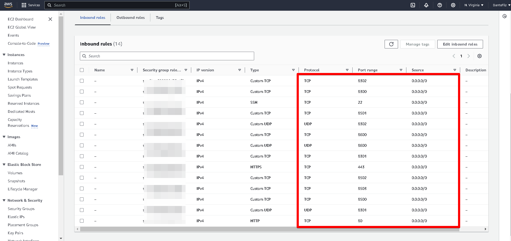

## Setup Consul Server
### Execute the following commands.

- SSH into the consul server and run **`sudo apt update`** to refresh the package cache.
- Visit the consul downloads page to copy the installation command.
- Or execute the following commands to install Consul.

```
wget -O- https://apt.releases.hashicorp.com/gpg | gpg --dearmor | sudo tee /usr/share/keyrings/hashicorp-archive-keyring.gpg

echo "deb [signed-by=/usr/share/keyrings/hashicorp-archive-keyring.gpg] https://apt.releases.hashicorp.com $(lsb_release -cs) main" | sudo tee /etc/apt/sources.list.d/hashicorp.list

sudo apt update && sudo apt install consul

```

- Confirmed Consul installation by checking its version with the **`consul --version`** command.
- All the Consul server configurations are located in the **`/etc/consul.d`** folder. To configure the Consul server, start by backing up the default configuration file **`consul.hcl`** by renaming it to **`consul.hcl.back`**, using the following command: **`sudo mv /etc/consul.d/consul.hcl /etc/consul.d/consul.hcl.back`**

- Generated an encrypted key using the **`consul keygen`** command.

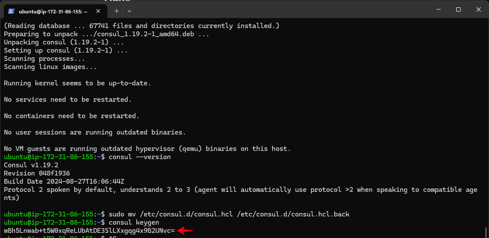

- Create a new file named consul.hcl in the **`/etc/consul.d`** directory, using the following command: **`sudo vi /etc/consul.d/consul.hcl`**
- Add the following content to the **`consul.hcl`** file, replacing <YOUR_ENCRYPTED_KEY> with the encrypted key you generated:

```
"bind_addr" = "0.0.0.0"
"client_addr" = "0.0.0.0"
"data_dir" = "/var/consul"
"encrypt" = "<YOUR_ENCRYPTED_KEY>"
"datacenter" = "dc1"
"ui" = true
"server" = true
"log_level" = "INFO"

```
- Save this file after adding the content.
- Run the following command to start the Consul server in the background: **`sudo nohup consul agent -dev -config-dir /etc/consul.d/ &`**.
- Checked the status of the Consul server with the following command: **`consul members`**.

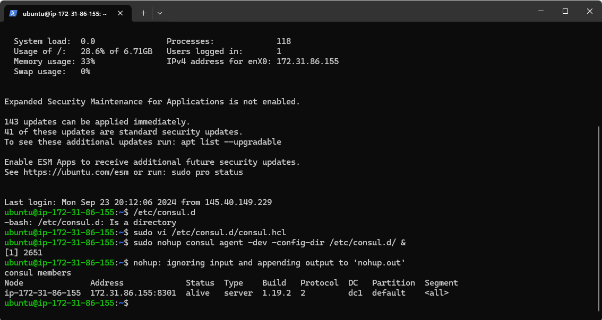

- If you visit **`<EC2 Consul Server IP>:8500`**, you should be able to access the Consul dashboard.

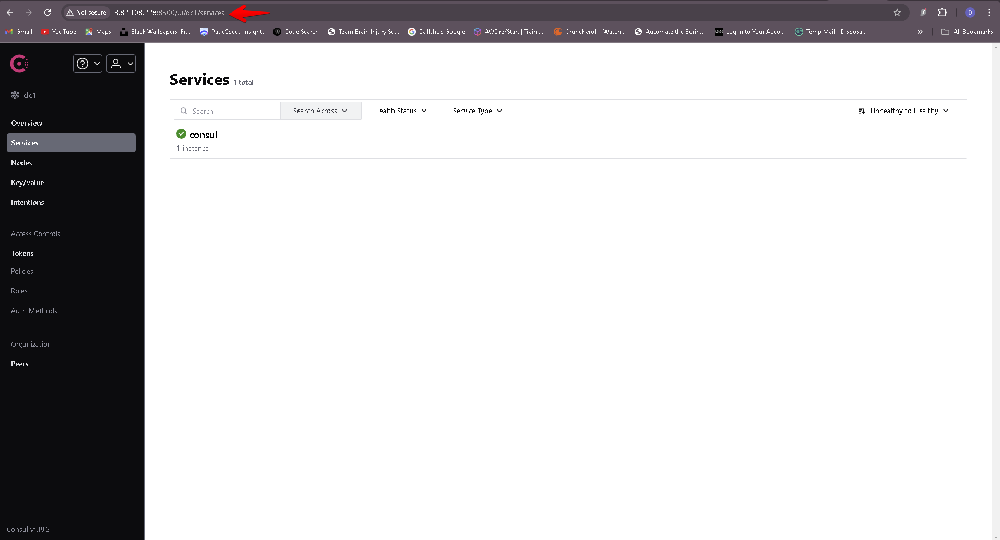

## Setup Backend Servers
### Execute the following commands.
- SSH into the backend servers and run **`sudo apt-get update -y`** to update package information.
- Installed Nginx on both instances by running the following command: sudo apt install nginx -y.
- Navigate to the HTML directory by executing the following command: cd /var/www/html.
- Open the HTML file with your preferred text editor to make edits: sudo vi index.html.
- Copied the HTML content below into the index.html file. On the second server, replaced SERVER-01 with SERVER-02 in the HTML file to differentiate between the two backend servers.

```
<!DOCTYPE html>
<html>
<head>
	<title>Filz Backend Server </title>
</head>
<body>
	<h1>This is Backend SERVER-01</h1>
</body>
</html>

```
- Installed Consul as an agent on the servers. Ran the following commands to install Consul:

```
wget -O- https://apt.releases.hashicorp.com/gpg | gpg --dearmor | sudo tee /usr/share/keyrings/hashicorp-archive-keyring.gpg

echo "deb [signed-by=/usr/share/keyrings/hashicorp-archive-keyring.gpg] https://apt.releases.hashicorp.com $(lsb_release -cs) main" | sudo tee /etc/apt/sources.list.d/hashicorp.list

sudo apt update && sudo apt install consul

```
- Verify that Consul is installed properly by running the following command: **`consul --version`**.

- Replaced the default Consul configuration file **`config.hcl`** located in **`/etc/consul.d`** with your custom **`consul.hcl`** file.
- Renamed the default file and create a new one by running the following commands:

```
sudo mv /etc/consul.d/consul.hcl /etc/consul.d/consul.hcl.back
sudo vi /etc/consul.d/consul.hcl

```
- Add the following contents to the file. Replace **`<YOUR_ENCRYPTED_KEY>`**① with your encryption key. Also, replace **`34.201.77.72`**② with your Consul server's IP address.

```
"server" = false
"datacenter" = "dc1"
"data_dir" = "/var/consul"
"encrypt" = "<YOUR_ENCRYPTED_KEY>"
"log_level" = "INFO"
"enable_script_checks" = true
"enable_syslog" = true
"leave_on_terminate" = true
"start_join" = ["34.201.77.72"]

```
- Next, we need to create a **`backend.hcl`** configuration file in the **`/etc/consul.d`** directory to register the Nginx service and its health check URLs with the Consul server. This will enable the Consul server to continuously monitor the health of the Nginx service. Use the following command to create and edit the file: **`sudo vi /etc/consul.d/backend.hcl`**.

- Added the following contents to the **`backend.hcl`** file and save it.

```
"service" = {
  "Name" = "backend"
  "Port" = 80
  "check" = {
    "args" = ["curl", "localhost"]
    "interval" = "3s"
  }
}

```
- Verified the configurations by executing the following command: **`consul validate /etc/consul.d`**

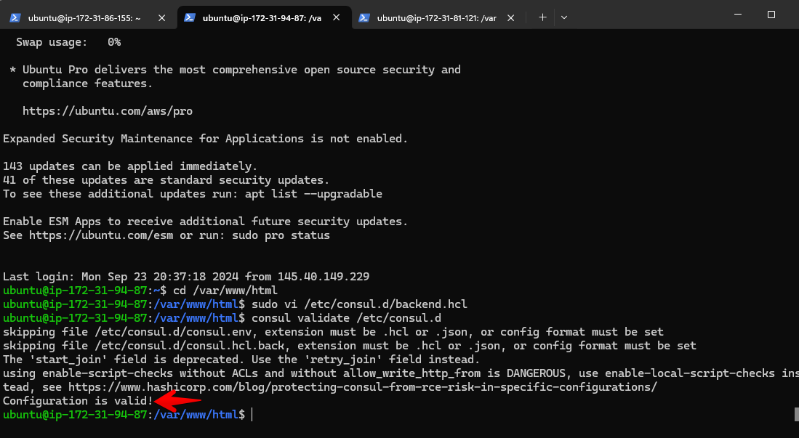


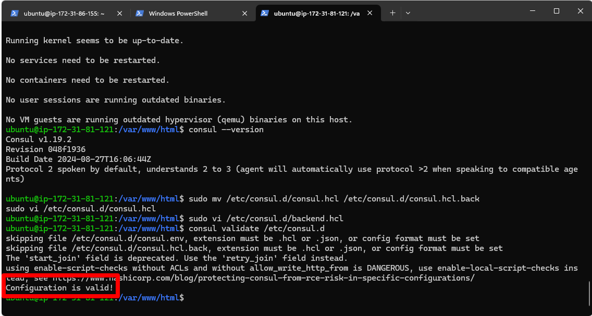

- All configurations are complete, start the Consul agent with the following command: **`sudo nohup consul agent -config-dir /etc/consul.d/ &`**

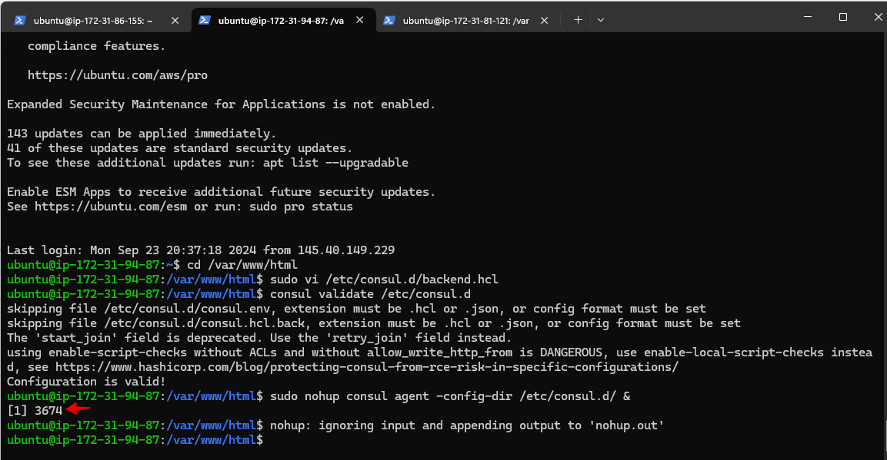


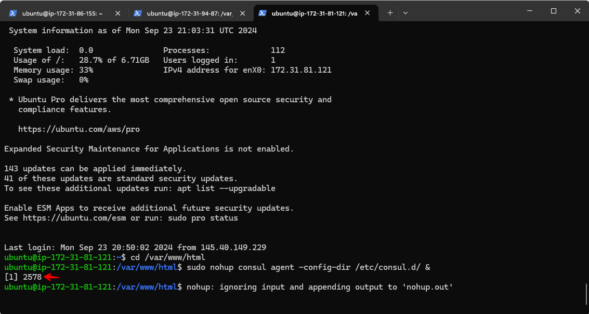


Confirmed with Consul UI to check if the backend had successfully registered.


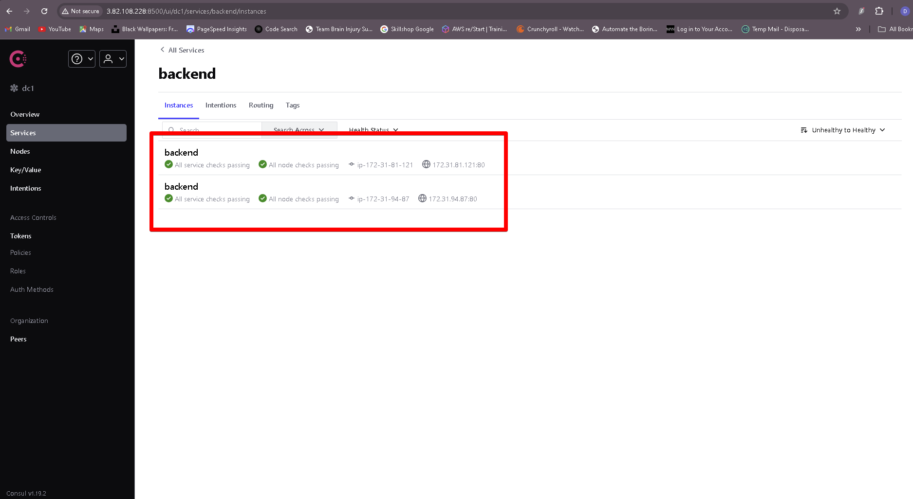

## Setup Load-Balancer
### Execute the following commands.
- Log in to the load-balancer server. Update the package information and install unzip with the following commands:

```
sudo apt-get update -y
sudo apt-get install unzip -y

```
- Install Nginx using the following command: **`sudo apt install nginx -y`**.
- Download the consul-template binary using the following command:

```
sudo curl -L  https://releases.hashicorp.com/consul-template/0.30.0/consul-template_0.30.0_linux_amd64.zip -o /opt/consul-template.zip

sudo unzip /opt/consul-template.zip -d  /usr/local/bin/

```
- Verified the installation of consul-template, check its version with the following command: **`consul-template --version`**.

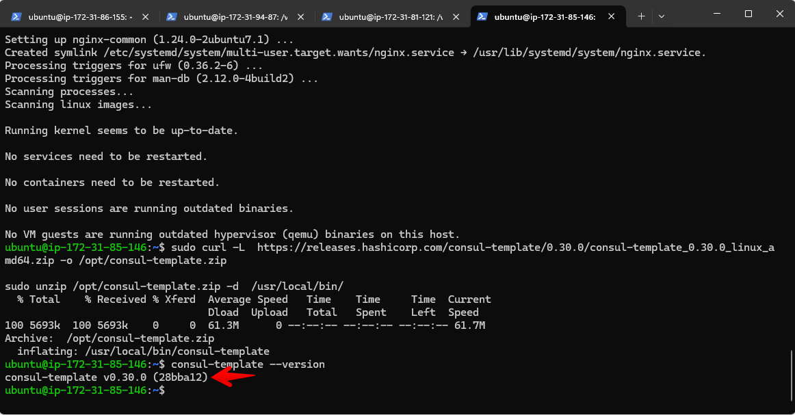

- Create and edit a file named load-balancer.conf.ctmpl in the /etc/nginx/conf.d directory, using the following command: **`sudo vi /etc/nginx/conf.d/load-balancer.conf.ctmpl`**.

- Paste the following content into the file:

```
upstream backend {
 {{- range service "backend" }} 
  server {{ .Address }}:{{ .Port }}; 
 {{- end }} 
}

server {
   listen 80;

   location / {
      proxy_pass http://backend;
   }
}

```

- Created a file named consul-template.hcl in the **`/etc/nginx/conf.d/`** directory. This configuration file is used by consul-template to specify details about the Consul server IP and the destination path where the processed load-balancer.conf file will be saved.

- Used the following command to create and edit the file: **`sudo vi /etc/nginx/conf.d/consul-template.hcl`**.

- Added the following content to the file, replacing **`<Consul Server IP>`** with your Consul server's IP address. This configuration specifies the Consul server details, the path to the template file, the destination for the rendered Nginx configuration, and the command to reload Nginx after updating the configuration.

```
consul {
 address = "<Consul Server IP>:8500"

 retry {
   enabled  = true
   attempts = 12
   backoff  = "250ms"
 }
}
template {
 source      = "/etc/nginx/conf.d/load-balancer.conf.ctmpl"
 destination = "/etc/nginx/conf.d/load-balancer.conf"
 perms       = 0600
 command = "service nginx reload"
}

```

- Deleted the default server configuration to disable it by running the following command: **`sudo rm /etc/nginx/sites-enabled/default`**

- Restarted Nginx to apply the changes by running the following command: **`sudo systemctl restart nginx`**.
- Once configurations are complete, start the Consul Template agent using the following command. It continuously monitors Consul for changes: 
- **`sudo nohup consul-template -config=/etc/nginx/conf.d/consul-template.hcl &`**

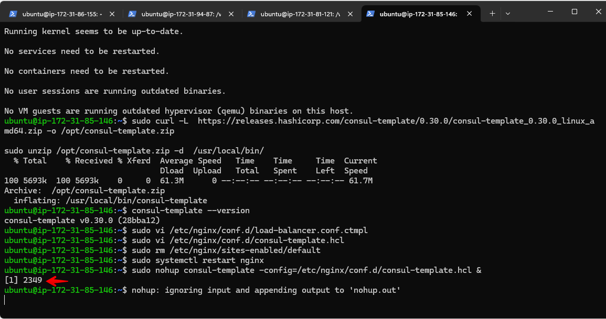

- On completion, the load-balancer.conf file was created with backend server information populated from the Consul service registry.

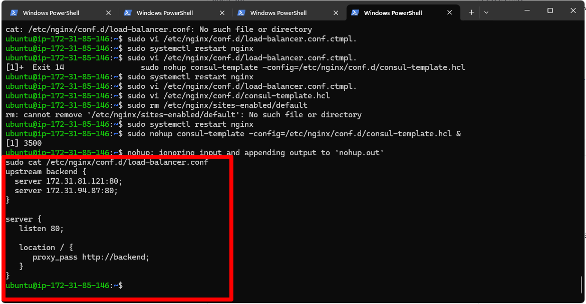

- Accessed the load balancer IP on a web browser, it displayed the custom HTML content from one of the backend servers. The load balancer routes the request to the other backend server upon refresh, displaying its custom HTML content.

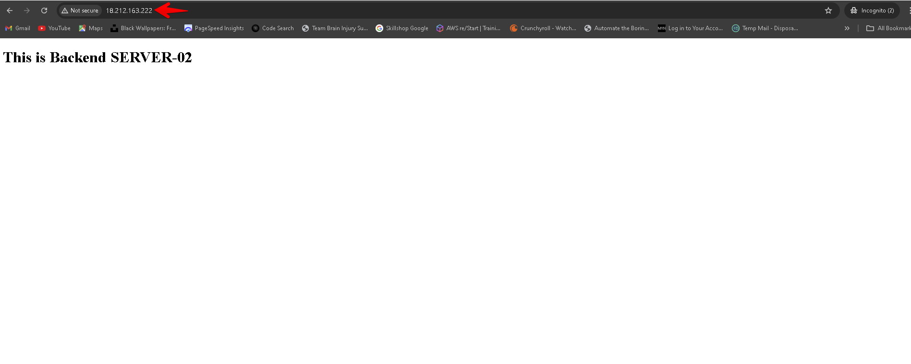


## Service Discovery Test

Tested the configuration by observing what happens when one of the backend server is stopped.

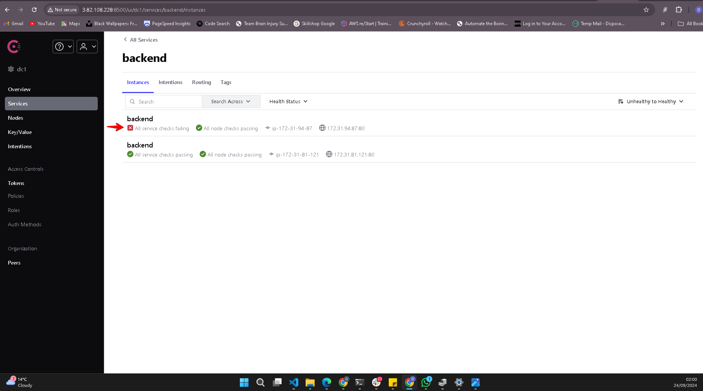


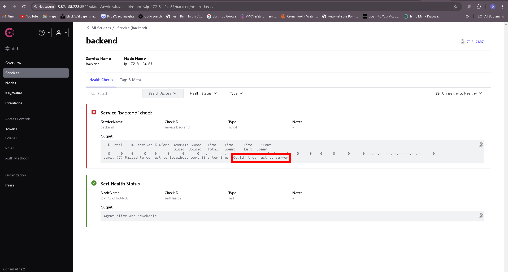


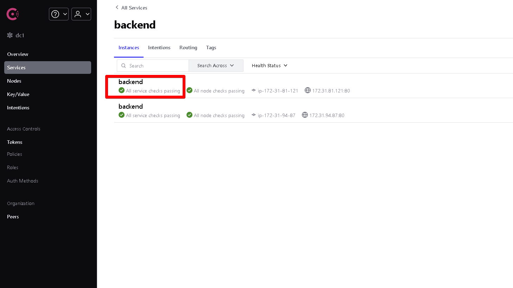


#### The End Of Project 5