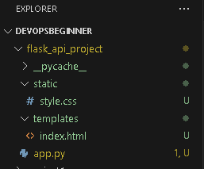
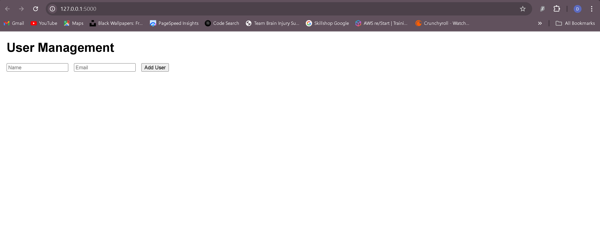
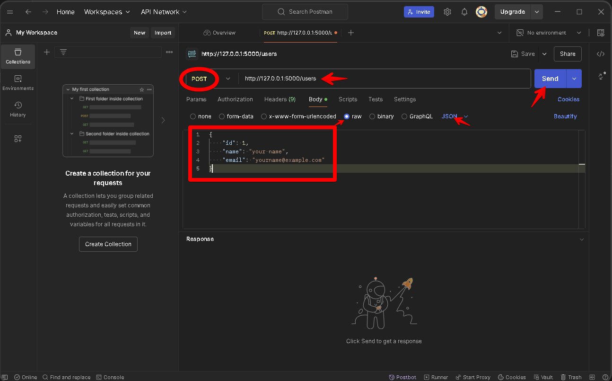
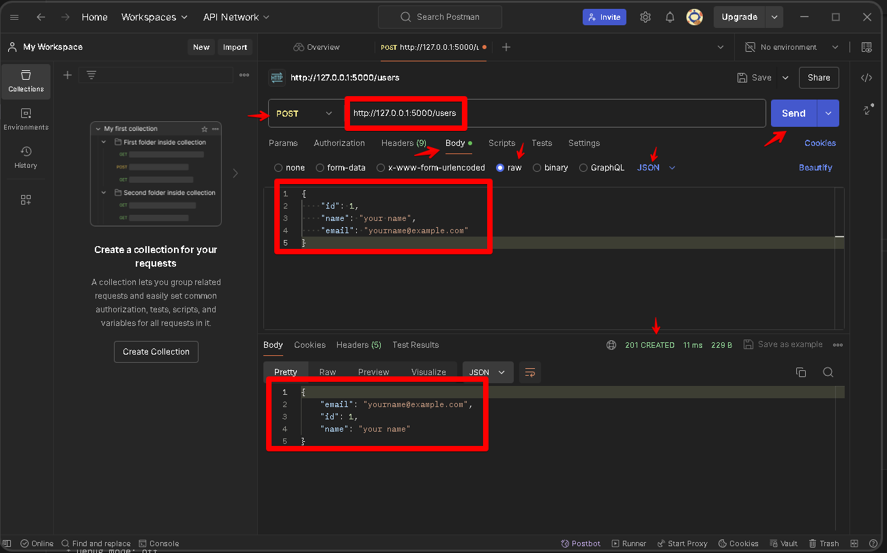

# Project 6: FLASK API PROJECT

## Introduction

An API, or application programming interface, is a collection of guidelines and procedures that facilitates communication between various software programs. It makes data interchange across systems easy, enabling developers to incorporate different features or services into their apps. By lowering the need to create features from scratch and fostering scalability and interoperability, APIs increase efficiency.

## Documentation

### Setting Up the Project
- Opened a terminal in vscode under the Git Bash
- Created a project directory structure and a virtual environment by running the following commands in VScode command line git bash:
- pasted the command below using gitbash

```

mkdir -p flask_api_project/{templates,static} && touch flask_api_project/app.py flask_api_project/templates/index.html flask_api_project/static/style.css && python -m venv flask_api_project/venv

```
This created the project environment below



The paste the follow in each of the file environment as listed

- In the **`app.py`** file paste the code below

```

from flask import Flask, request, jsonify, render_template

app = Flask(__name__)

users = []

@app.route('/')
def home():
    return render_template('index.html')

@app.route('/users', methods=['POST'])
def create_user():
    user = request.get_json()
    users.append(user)
    return jsonify(user), 201

@app.route('/users', methods=['GET'])
def get_users():
    return jsonify(users), 200

@app.route('/users/<int:user_id>', methods=['GET'])
def get_user(user_id):
    user = next((u for u in users if u['id'] == user_id), None)
    return jsonify(user), 200 if user else 404

@app.route('/users/<int:user_id>', methods=['PUT'])
def update_user(user_id):
    user = request.get_json()
    index = next((i for i, u in enumerate(users) if u['id'] == user_id), None)
    if index is not None:
        users[index] = user
        return jsonify(user), 200
    return '', 404

@app.route('/users/<int:user_id>', methods=['DELETE'])
def delete_user(user_id):
    global users
    users = [u for u in users if u['id'] != user_id]
    return '', 204

if __name__ == '__main__':
    app.run(debug=True)

```
- In the **`index.html`** in the **`templates`** directory paste the code below

```

<!DOCTYPE html>
<html lang="en">
<head>
    <meta charset="UTF-8">
    <meta name="viewport" content="width=device-width, initial-scale=1.0">
    <title>API-Based Application</title>
    <link rel="stylesheet" href="{{ url_for('static', filename='style.css') }}">
</head>
<body>
    <h1>User Management</h1>
    <form id="userForm">
        <input type="text" id="name" placeholder="Name" required>
        <input type="email" id="email" placeholder="Email" required>
        <button type="submit">Add User</button>
    </form>
    <ul id="userList"></ul>

    <script>
        document.getElementById('userForm').addEventListener('submit', async function (event) {
            event.preventDefault();
            const name = document.getElementById('name').value;
            const email = document.getElementById('email').value;
            
            const response = await fetch('/users', {
                method: 'POST',
                headers: {
                    'Content-Type': 'application/json'
                },
                body: JSON.stringify({ name, email })
            });

            const user = await response.json();
            document.getElementById('userList').innerHTML += `<li>${user.name} (${user.email})</li>`;
        });
    </script>
</body>
</html>

```
- In the **`style.css`** in the **`static`** directory paste this code below;

```

body {
    font-family: Arial, sans-serif;
    margin: 20px;
}

form {
    margin-bottom: 20px;
}

input {
    margin-right: 10px;
}

```

then execute the following command in your terminal

```
python -m venv venv
source venv/Scripts/activate
pip install Flask

```


- Making sure you have python installed already. If not install and restart vscode
- Then run the Flask application using the command: **`flask run`**
- Open your browser and go to  **`http://127.0.0.1:5000`**  to see your application.



- Add new users to confirm


## Testing the API 

- Download postman
- Create a new request
- Set the request type to POST and enter **`http://127.0.0.1:5000/users`**.
- Go to the Body tab, select **`raw`**, and choose **`JSON`** from the dropdown.
- Enter the **`JSON`** data:

```
{
    "id": 1,
    "name": "your name",
    "email": "yourname@example.com"
}

```



- Click **`Send`** and check the response.



- Action was successfully as the code **`200 ok`** is seen.
- Other HTTP Status Codes includes

```
200 OK: The request was successful (common for GET, PUT).
201 Created: A new resource was created (common for POST).
204 No Content: The resource was successfully deleted (common for DELETE).
404 Not Found: The requested resource was not found (if you try to GET, PUT, or DELETE a non-existing user).

```

#### The End Of Project 6