# Project 7: AWS VPC Project

## Introduction
## What is a VPC?

A VPC (Virtual Private Cloud) in AWS (Amazon Web Services) is a service that allows you to launch AWS resources in a logically isolated virtual network that you define. Here are the key components and features of an AWS VPC:

1. **Subnets**: A VPC can be divided into multiple subnets, which are sections of the VPC IP address range where you can place groups of isolated resources. Subnets can be either public (with access to the internet) or private (isolated from the internet).

2. **IP Addressing**: You can choose your own IP address range for the VPC using IPv4 or IPv6 addresses.

3. **Route Tables**: Control the routing of network traffic within the VPC and between subnets. You can create custom route tables to direct traffic as needed.

4. **Internet Gateway**: A VPC component that allows communication between instances in your VPC and the internet. You need to attach an Internet Gateway to a VPC to enable internet access for your instances.

5. **NAT Gateway and NAT Instances**: A NAT gateway is a Network Address Translation (NAT) service. These allow instances in a private subnet to connect to the internet or other AWS services without exposing themselves to incoming traffic from the internet.

6. **Security Groups**: Act as virtual firewalls for your instances to control inbound and outbound traffic at the instance level.

7. **Network ACLs (Access Control Lists)**: Provide an additional layer of security, controlling traffic at the subnet level. Network access control list (NACL) is the native VPC functionality to control the inbound and outbound traffic at the subnet level. In our architecture, the connection to the DB subnet should be allowed only from the App subnet and management subnet. The public subnet should not have direct access to the DB subnet.

8. **VPC Peering**: Allows you to connect one VPC with another VPC to route traffic between them using private IP addresses.

9. **VPN Gateway**: Enables you to establish a secure connection between your VPC and your on-premises network.

10. **VPC Endpoints**: Allow you to privately connect your VPC to supported AWS services and VPC endpoint services powered by AWS PrivateLink without requiring an Internet Gateway, NAT device, VPN connection, or AWS Direct Connect connection.

11. **AWS Direct Connect**: Provides a dedicated network connection from your premises to AWS, enhancing security and reducing network costs.


## VPC Documentation
Documentation is one of the most important aspects of VPC design. To guarantee that the VPC remains compatible over time, all VPC configurations must to be recorded.

VPC Details
Following are the VPC details, region, and availability zones used for this project.

1. CIDR Block: 10.0.0.0/16
2. Region: us-west-2
3. Availability Zones: us-west-2a, us-west-2b, us-west-2c
4. Subnets: 15 Subnets (One per availability Zone)

### Setting Up a VPC and assigning an internet gateway to it

- Login to your AWS management console and search VPC

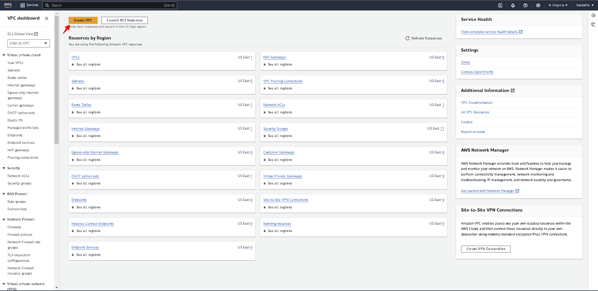

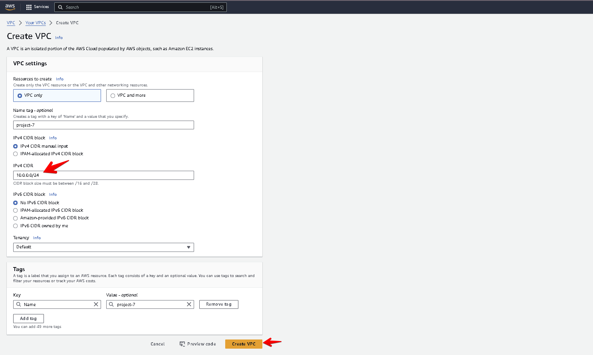

- VPC is now created and then click on the Internet Gateway to create Internet Gateway

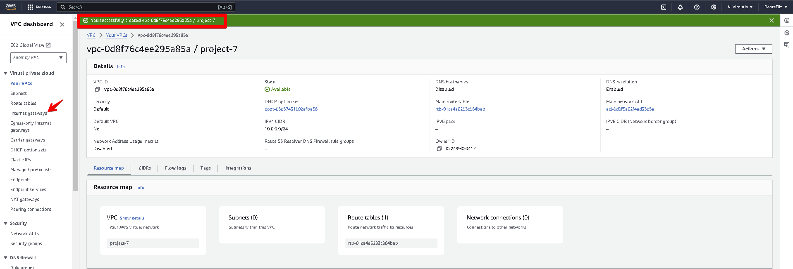

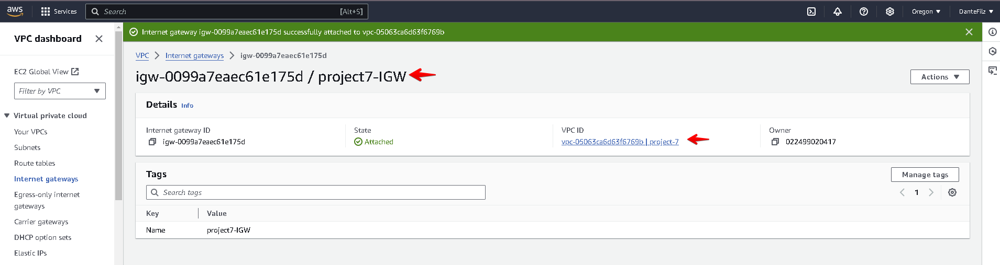

Following subnet naming schemes, the subnets were created

```
EnvName-AppType-RouteType-AZ
```

| Subnet Name          | Availability Zone | CIDR Block  | Type   |
|----------------------|-------------------|-------------|--------|
| Prod-Web-Public-2a   | us-west-2a        | 10.0.0.0/28  | Public |
| Prod-Web-Public-2b   | us-west-2b        | 10.0.0.16/28 | Public |
| Prod-Web-Public-2c   | us-west-2c        | 10.0.0.32/28 | Public |

- Using the above table data, we will create the public subnet

- Click on create create subnet
- select the VPC created earlier for project 7
- Under subnet settings (Subnet 1 of 1), input the Subnet Name from  table **`Prod-Web-Public-2a`**
- Select the Availability Zone
- Select the CIDR Block **`10.0.0.0/24`**
- Input the subnet CIDR block from the table
- Then add for remaining prod subnets (prod-web-public b,c)
- Then click on create.
- Public Subnets

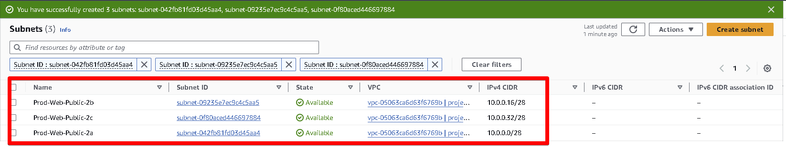

- Subnets was then created for the following below
   
- Application Subnets

| Subnet Name          | Availability Zone | CIDR Block  | Type    |
|----------------------|-------------------|-------------|---------|
| Prod-App-Private-2a  | us-west-2a        | 10.0.0.48/28 | Private |
| Prod-App-Private-2b  | us-west-2b        | 10.0.0.64/28 | Private |
| Prod-App-Private-2c  | us-west-2c        | 10.0.0.80/28 | Private |

- Database Subnets

| Subnet Name         | Availability Zone | CIDR Block  | Type    |
|---------------------|-------------------|-------------|---------|
| Prod-DB-Private-2a  | us-west-2a        | 10.0.0.96/28 | Private |
| Prod-DB-Private-2b  | us-west-2b        | 10.0.0.112/28 | Private |
| Prod-DB-Private-2c  | us-west-2c        | 10.0.0.128/28 | Private |

- Management Subnets

| Subnet Name           | Availability Zone | CIDR Block   | Type    |
|-----------------------|-------------------|--------------|---------|
| Prod-Mgmt-Private-2a  | us-west-2a        | 10.0.0.144/28 | Private |
| Prod-Mgmt-Private-2b  | us-west-2b        | 10.0.0.160/28 | Private |
| Prod-Mgmt-Private-2c  | us-west-2c        | 10.0.0.176/28 | Private |

- Platform Subnets

| Subnet Name              | Availability Zone | CIDR Block   | Type    |
|--------------------------|-------------------|--------------|---------|
| Prod-Platform-Private-2a | us-west-2a        | 10.0.0.192/28 | Private |
| Prod-Platform-Private-2b | us-west-2b        | 10.0.0.208/28 | Private |
| Prod-Platform-Private-2c | us-west-2c        | 10.0.0.224/28 | Private |

- all the subnets created

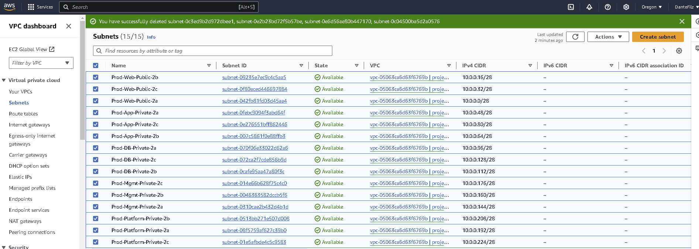

# Route Table Design
- For each subnet group, a custom route table was created and assigned rules required for the specific subnets.

- All three public subnets share the same public-subnet route table.

| Subnet      | Destination CIDR | Target           |
|-------------|------------------|------------------|
| Public      | 0.0.0.0/0        | Internet Gateway |
| App         | 0.0.0.0/0        | Nat Gateway      |
| DB          | 0.0.0.0/0        | Nat Gateway      |
| Management  | 0.0.0.0/0        | Nat Gateway      |
| Platform    | 0.0.0.0/0        | Nat Gateway      |


Using the table above, 5 route tables were created using the following steps;

- Select the Route table on the side menu
- Give it a name and select the VPC created earlier
- Click on create
- Assocaite the public subnet to the route table by clicking on the Subnet association
- Edit subnet association
- Select the subnet for each similar application and add eg 3 public subnets (prod-web-public a,b,c)
- Click on Save association
- Repeat for each route table and associate them to their subnet

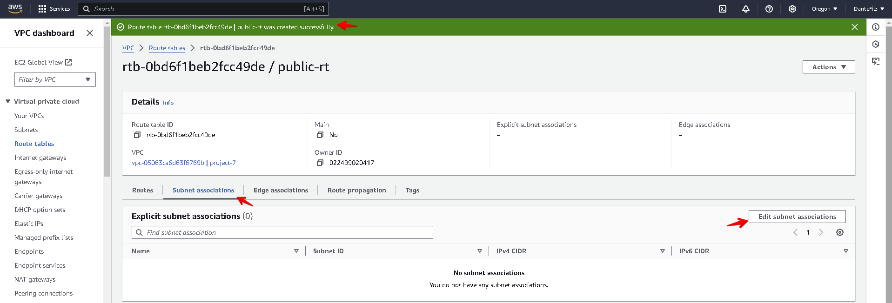

- Complete table should look like this

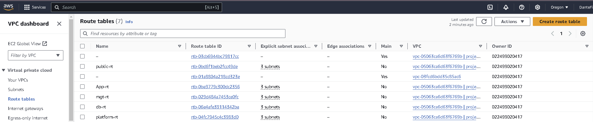

### NAT Gateway
A NAT gateway is created and attached to all the route tables created earlier using the following steps

- Click on NAT gateways on the side menu bar and click on create
- Name the NAT Gateway
- Select the subnet associated with the application
- Select Public for connectivity type
- Select the Elastic IP allocation ID and associate Elastic IP
- Click on Create NAT gateway

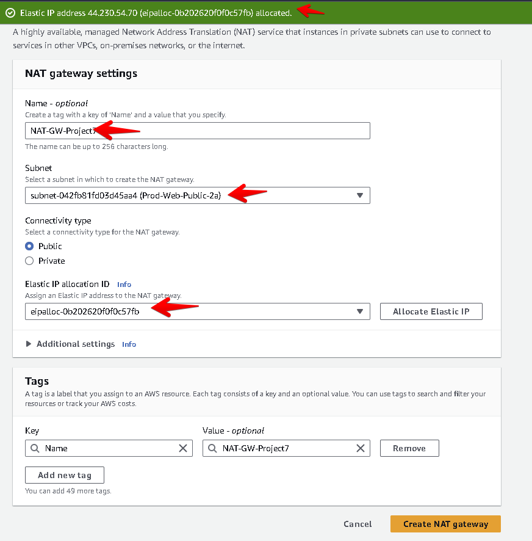

- Now add the NAT gateway to the route tables one by one
- Select an application route table from the list
- Click on Routes below and click on edit
- For Destination select 0.0.0.0/0
- For the Target select NAT gateway
- Select the NAT gateway created earlier and save changes
- The status of the NAT gateway it now active
- Repeat steps for all route tables except for **`Public-RT`**

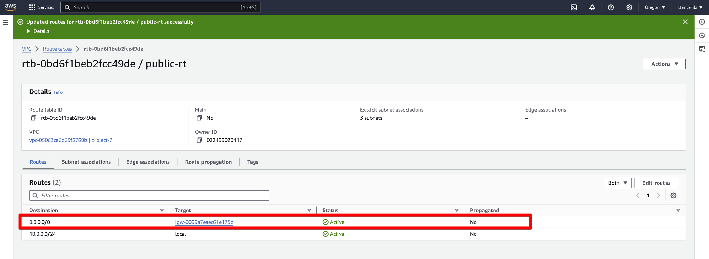

- For Public-RT, we route traffic using a service called **`Internet Gateway`** using the follow steps
- Select the Public-RT
- Click on Routes and Edit Routes
- Click on Add route and select 0.0.0.0/0
- Select Internet gateway and the associate link and save


### AWS VPC Topology
The images below show the high-level VPC topology for our design both the internet Gateway (IGW) and NAT gateway(NAT-GW) gets deployed in the public subnet. 

To check our VPC topology, do the following steps:

- Click on Your VPCS on the side menu
- Select Project 7
- Click on Resource map
- The image below should display

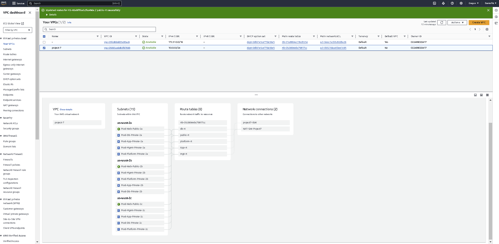


### Network ACLs

The following are the tables for inbound and outbound rules for the DB NACL.

# DB NACL (Inbound Rules)

| Rule Number | Type       | Protocol | Port Range | Source IP   | Allow/Deny |
|-------------|------------|----------|------------|-------------|------------|
| 100         | Custom TCP | TCP      | 3306       | 10.0.0.96/28 | Allow     |
| 110         | Custom TCP | TCP      | 3306       | 10.0.0.112/28 | Allow    |
| 120         | Custom TCP | TCP      | 3306       | 10.0.0.128/28 | Allow    |
| *           | All Traffic| All      | All        | 0.0.0.0/0   | Deny       |


# DB NACL (Outbound Rules)


| Rule Number | Type       | Protocol | Port Range | Destination IP | Allow/Deny |
|-------------|------------|----------|------------|----------------|------------|
| 100         | Custom TCP | TCP      | 3306       | 10.0.0.192/28    | Allow    |
| 110         | Custom TCP | TCP      | 3306       | 10.0.0.208/28    | Allow    |
| 120         | Custom TCP | TCP      | 3306       | 10.0.0.224/28    | Allow    |
| *           | All Traffic| All      | All        | 0.0.0.0/0        | Deny     |


To implement the NACLs, do the following steps

- Click on the Network ACLs on the side bar and click on create
- Name the NACL
- Select your VPC based on your project
- Clieck on create network ACL
- Click on Inbound rules and add the details on the table and save changes


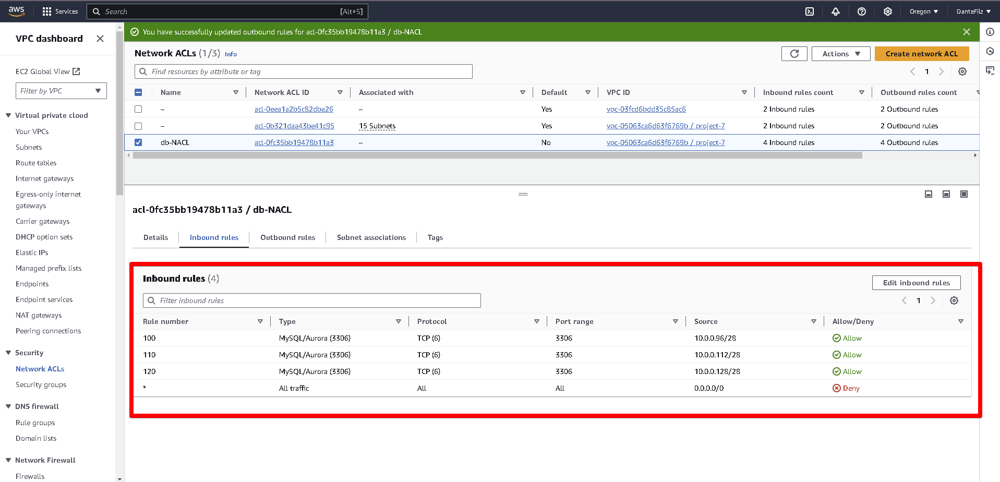

- Click on Outbound rules and do same and save

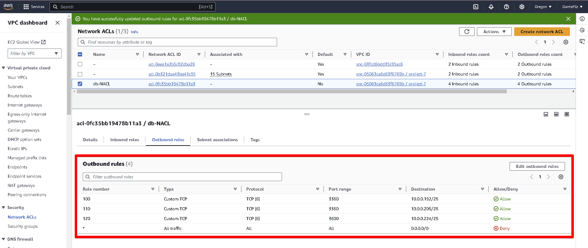

#### The End Of Project 7